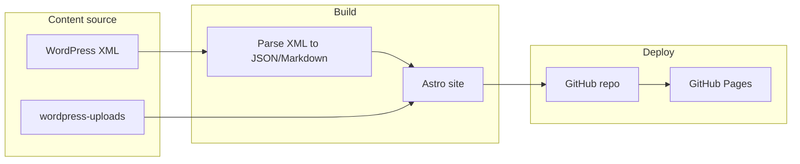

# Static Site Rebuild and GitHub Pages Hosting

## Approach

- **Framework:** [Astro](https://astro.build) — static by default, minimal JS, excellent for content-heavy sites, and [officially supports GitHub Pages](https://docs.astro.build/en/guides/deploy/github/). Build outputs a static folder that GitHub Pages can serve.
- **Hosting:** **GitHub Pages** — free, supports custom domain (newvintageamps.com), SSL, and no server to maintain. Alternative options (Netlify, Vercel, Cloudflare Pages) are also viable if you prefer; the same static build works everywhere.
- **Content source:** Existing [newvintageamplifiers.WordPress.2026-03-13.xml](newvintageamplifiers.WordPress.2026-03-13.xml) and [wordpress-uploads/](wordpress-uploads/) (217 images already in repo).
- **Scope:** Same NAV structure for main content; **remove** Shop, Cart, Checkout, My Account, and all Customizer pages. Contact is mailto-only ([info@newvintageamps.com](mailto:info@newvintageamps.com)).

---

## Architecture (high level)

---

## 1. Content pipeline

- **Parse the WordPress XML once** (build-time or a one-off script) to produce:
  - **Site structure:** List of published pages and their hierarchy (from the NAV menu in the XML).
  - **Page content:** Title, slug, HTML body (from `content:encoded`), and any metadata. Strip WordPress shortcodes (e.g. `[bd_paypal ...]`, `[bd_col_4]`, `[bd_separator]`) and normalize image URLs to point at local paths under `wordpress-uploads/` (or a copy in `public/` so they are served by GitHub Pages).
- **Exclude from output:** Any page whose slug or purpose is shop, cart, checkout, my-account, or customizer (combo/head-cab/bass customizers, mobile customizers, etc.). Keep: Home, Guitar Amps, Bass Amps, Speaker Cabinets, Cables, Amp Color Options, Artists, About (and its children: Contact, How To Buy, Become a New Vintage Artist, FAQ, Legacy Models), and all product/cabinet subpages that are informational only.
- **NAV:** Drive the header/footer nav from the parsed structure so the menu matches current NAV (minus removed items). No dropdowns required to be dynamic; static HTML/CSS is fine.

---

## 2. Astro project structure

- **Repo layout (after rebuild):**
  - `src/pages/` — one route per page (can use dynamic routes like `[...slug].astro` and a content list, or one file per top-level section).
  - `src/components/` — Layout, Nav, Footer, PageContent (for rich HTML from XML).
  - `src/data/` or `src/content/` — parsed page data (e.g. `pages.json` + HTML or Markdown per page). Option: use Astro Content Collections with Markdown generated from XML.
  - `public/` — static assets; copy or symlink `wordpress-uploads` into `public/uploads` (or `public/images`) so URLs like `/uploads/2013/05/foo.jpg` work.
- **Build:** `astro build` → output in `dist/`. GitHub Pages will serve the contents of `dist/` (or the root of a `gh-pages` branch / `docs/` folder, depending on config).

---

## 3. Design (same feel, modernized)

- **Reference:** Current site (newvintageamps.com): amp/cabinet imagery, dark or neutral backgrounds, clear typography. Keep a similar **mood** (product photography, clear hierarchy).
- **Modernization:**
  - **Typography:** System font stack or a single webfont (e.g. for headings); larger, readable body text and line-height.
  - **Layout:** CSS Grid/Flexbox; responsive breakpoints so mobile matches the existing NAV (e.g. hamburger or simplified menu).
  - **Colors:** Retain a dark or neutral palette; refine contrast for accessibility.
  - **Spacing and rhythm:** Consistent vertical rhythm and section padding.
  - **Images:** Use existing assets from `wordpress-uploads/`; responsive images (`srcset`) where it matters (e.g. hero, product grids).
- **No heavy UI framework required;** vanilla CSS or a small utility layer (e.g. Astro’s style approach) is enough.

---

## 4. GitHub Pages setup

- **Option A — Build in CI, deploy from branch:**
  - Push Astro source to the same repo (e.g. `main`).
  - GitHub Actions workflow: on push to `main`, run `npm ci && npm run build`, then deploy `dist/` to the `gh-pages` branch (or use `actions/upload-pages-artifact` and deploy from `main` with “GitHub Actions” as source).
  - In repo **Settings → Pages**: Source = “Deploy from a branch” or “GitHub Actions”; branch = `gh-pages` (root) or the branch that holds the built site.
- **Option B — Build locally, push `dist/`:** Less ideal (build artifacts in repo), but possible: build locally, push `dist/` to a branch and set that as the Pages source.
- **Custom domain:** In **Settings → Pages**, set “Custom domain” to `newvintageamps.com`. Add the CNAME record (and any A/AAAA records GitHub recommends) at your DNS provider (e.g. where the domain is registered). HTTPS will be provisioned by GitHub once DNS is correct.

---

## 5. Implementation order

1. **Content extraction script** — Parse XML → JSON (and optionally HTML/MD files); map image URLs to local paths; output list of “include” pages and nav tree (excluding shop/customizer).
2. **Astro scaffold** — New Astro project in repo (or subfolder); configure `site` and `base` for GitHub Pages if using a project subpath.
3. **Layout and NAV** — Global layout + Nav component driven by the parsed nav tree; Footer with contact/mailto.
4. **Page templates** — One or more Astro pages that consume the extracted content and render HTML (with sanitization if needed).
5. **Styling** — Global styles + components; responsive nav; use existing images from `public/`.
6. **Build and test** — `astro build`; verify links, images, and nav.
7. **GitHub Actions** — Workflow to build and deploy to GitHub Pages.
8. **Docs** — Short README on how to run dev, build, and how to point the custom domain.

---

## 6. What you’ll do after the rebuild

- **DNS:** Point newvintageamps.com to GitHub Pages (CNAME or A records as per GitHub’s docs).
- **GoDaddy:** Cancel hosting when you’re ready; keep domain registration and update nameservers/records to point to GitHub (or transfer domain later if desired).

---

## Summary

| Item          | Choice                                             |
| ------------- | -------------------------------------------------- |
| Framework     | Astro (static)                                     |
| Hosting       | GitHub Pages (free)                                |
| Custom domain | Supported (configure in repo + DNS)                |
| NAV           | Same structure; shop/customizer removed            |
| Contact       | Mailto only                                        |
| Content       | From WordPress XML + local images                  |
| Design        | Same feel; modernized type, layout, responsiveness |

No edits will be made until you confirm this plan. If you want to use Netlify/Vercel instead of GitHub Pages, the same Astro build works; only the deploy step (and optional serverless form, if you add one later) would change.

---

## Future extensibility

The static Astro build can be extended later without a full rewrite. Below are options for adding a Customizer and/or e-commerce.

### Customizer (amp/cabinet configurator)

- **Option A — Client-side only:** Add a Customizer page that runs entirely in the browser. Options, preview logic, and image swapping are handled with JavaScript; no server required. On "Submit" or "Request quote," send the configuration via a mailto link (e.g. pre-filled subject/body) or a static contact form (e.g. Formspree) so you receive the spec by email. Site stays static and can remain on GitHub Pages.
- **Option B — Client-side + lightweight backend:** Same as A, but "Submit" POSTs the config to a small serverless function (e.g. Netlify/Vercel/Cloudflare Function) that stores it in a database or forwards to your email/CRM. Requires moving deploy to a host that supports serverless (or adding a separate microservice). The rest of the site stays static.

### E-commerce

- **Recommended approach — Cart overlay or payment links (stay static):** Keep the site static and add "Add to cart" / "Buy" without running your own cart or checkout backend.
  - **Snipcart:** Define products in HTML or JSON on your pages; Snipcart injects a cart and checkout. You get a cart overlay, product variants, and optional inventory. Works on GitHub Pages; Snipcart charges a percentage per transaction. Good fit for a small catalog and custom/semi-custom products.
  - **Stripe Payment Links:** Create a payment link per product (or per product variant) in the Stripe Dashboard; add "Buy" buttons on the site that open Stripe-hosted checkout. No cart; each button is a direct checkout. Works on any static host including GitHub Pages. Best when you have a limited, stable set of products and don’t need a full cart experience.
  - **Shopify Buy Button or Lite:** Embed Shopify buy buttons or link to a Shopify store (e.g. shop.newvintageamps.com). Main site stays static; Shopify handles catalog, cart, and checkout. Use when you want full store features (inventory, orders, shipping) without building them yourself.
- **Alternative — Full cart/checkout on your domain:** Implement cart and checkout (e.g. with Stripe API, or a headless CMS + payment provider). Requires a host that can run serverless or a backend (Netlify, Vercel, Cloudflare Pages, or a separate API). The existing Astro pages and content can stay; you add API routes and optional client-side cart state. More control, more implementation and maintenance.

**Suggested path for NVA:** Start with **Stripe Payment Links** or **Snipcart** when you’re ready to sell online: no backend to run, works with the current static + GitHub Pages setup, and scales to a small catalog. If you later need full inventory and order management, add or migrate to Shopify (or similar) and keep the main marketing site in Astro.